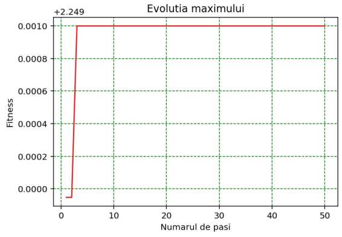
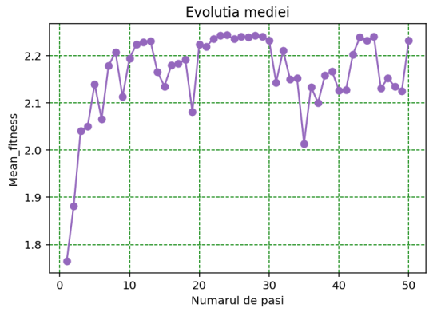

> Finding the maximum value of a second-degree polynomial function using a Genetic Algorithm

### Steps:

- **initialization**: the first generation of chromosomes are randomly chosen after descritizing the given function domain (a bounded interval) using a given precision. Each chromosome (implemented as a bit string) is a fixed-point representation of a real number obtained after the discretization.
- for each generation, the chromosome with the biggest fitness is automatically passed to the next generation, skipping any other operation.
- **selection**: a fitness proportionate (roulette wheel) selection is implemented.
- **crossover**: based on the input parameters, either one or two randomly-generated breaking points are chosen. (Each chromosome has a given crossover probability)
- **mutation**: for each gene of a chromosome (i.e. a 0/1 value of a bit string), a random uniform variable is generated. If that variable is less than the input mutation probability, then that value gets replaced with its complement.
- best chromosome preservation, selection, crossover and mutation are then applied for each iteration of the algorithm.
  
The evolution of the fitness function with each iteration:

The evolution of the mean fitness with each iteration:

